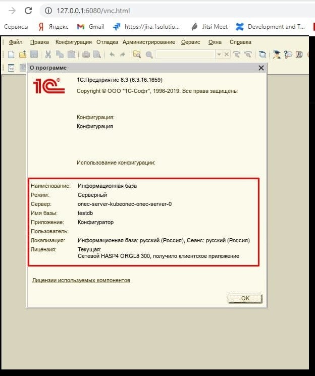

# Kubeonec

# Запуск сервера 1С:Предприятия в кластере kubernetes

## Важно: 

Запуск сервера 1С:Предприятие в кластере kubernetes официально не поддерживается вендером, по этому все что мы делаем является экспериментальными проектами и не подходят в работе по продуктивном окружении. Использование данного проекта целиком и полностью на вашей ответственности и разработчик не несет никакой ответственности за какие либо проблемы или потерю данных.  

Документация пока носит пока служебный формат и пока по факту является моими набросками для запуска и отладки. В дальнейшем будет приведена в нормальное состояние.

## Запуск кластера


1. Создаем новый namespace

```
kubectl create ns onec
```

2. При использовании приватного docker registry необходимо создать секрет, с указанием параметров авторизации.

```
kubectl create secret docker-registry regcred -n onec --docker-server=https://index.docker.io/v1/ --docker-username=demoncat --docker-password=1e9f9a94-9d68-4ac9-9927-debc8dbb689f --docker-email=nl.ruslan@yandex.ru

```
, где 

`<your-registry-server>` Адрес приватного Docker Registry FQDN. (https://index.docker.io/v1/ для DockerHub)
`<your-name>`  Пользователь Docker.
`<your-pword>` Пароль Docker.
`<your-email>` Электронная почта пользователя Docker.

Затем прописать этот секрет в файле переменных values.yaml в блоке:

```
imagePullSecrets: [
    "regsecret"
]
```

3. устанавливаем инстанс из чарта

```
    helm upgrade -i onec-server -n onec -f %CD%\charts\kubeonec\values.yaml  %CD%\charts\kubeonec
```


```
    helm upgrade -i onec-server -n onec -f values.yaml  charts/kubeonec
```

## Создание серверной базы

TODO




## Установка API сервера управления кластером 1C

В текущем чарте поддерживаются 2 варианта сервера

- [HiRAC](https://github.com/arkuznetsov/hirac) от Артема Кузнецова -  бесплатный
- [Odin](Link) от Алексея Хорева - платный

Выбор сервера управления осуществляется в настройках чарта по пути `api_cluster_manager.name`

На текущий момент по умолчанию стоит `Odin`, но планируется изменение на `HiRAC`


### ODIN

для работы ODIN необходимо создать объект с типом secret, содержащий файл лицензии. Для этого необходимо расположить файл лицензии по пути
`odin/license.lic` и создать секрет командой:

```
kubectl create secret generic odin-lic -n onec --from-file=odin/license.lic
```

По умолчанию Odin стартует на 3001 порту, для доступа с текущего хоста пробрасываем порт:

```
$ ku get pods -n onec
NAME                                                     READY   STATUS    RESTARTS   AGE
onec-server-kubeonec-onec-client-5967769898-c5k6g        1/1     Running   0          34m
onec-server-kubeonec-onec-cluster-api-7c68966c54-69dvn   2/2     Running   0          16m
onec-server-kubeonec-onec-server-0                       1/1     Running   0          26h
onec-server-kubeonec-postgres-0                          1/1     Running   0          26h

ku port-forward -n onec onec-server-kubeonec-onec-cluster-api-7c68966c54-69dvn 3001:3001
Forwarding from 127.0.0.1:3001 -> 3001
Forwarding from [::1]:3001 -> 3001
```

После проброса порта ресурсы доступны по адресам:

Документация - http://localhost:3001/docs/index.html

API - http://localhost:3001/api/v1/

Примеры запросов [тут](odin/Readme.md)

## Сборка образов 1С

1. Для отправки образа в удаленное docker registry необходимо создать файл `config.json` и смонтировать его в нужное место.
Если уже было выполнено создание секрета `regcred`, то он и монтируется. 


2. Создаем конфигурационный файл `.env` с параметрами авторизации на площадке 1С

```
    ONEC_USERNAME=<ПОЛЬЗОВАТЕЛЬ_USERS.1C.V8.RU>

    ONEC_PASSWORD=<ПАРОЛЬ_ОТ_USERS.1C.V8.RU>
    
    ONEC_VERSION=8.3.14.1993

```
3. Создаем секрет с параметрами авторизации на площадке 1С

```
kubectl create secret generic user-onec -n onec --from-env-file=.env
```

4. Запускаем задачу сборки образа

```
kubectl apply -n onec -f stuffing/job.yaml
```
